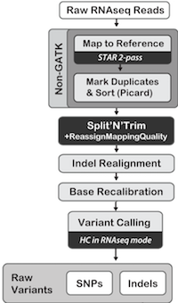

## Variant calling based on RNA-Seq
RNA-Seq variant calling pi[eline according to [GATK Best practices](https://www.broadinstitute.org/gatk/guide/article?id=3891).

#### Run mRNA-Seq variant pipeline

```bash
bash mRNA.variant_master.sh -d {raw_directory}

arguments:
d=[d]irectory with raw data (directory; required)  
g=directory with the reference [g]enome  
    accepted values:GRC98, Mmul_8  
e=[e]mail address
```


